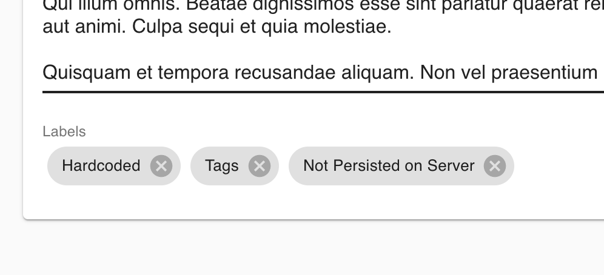

# Coding exercise

If you're reading this… Congratulations 🎉!! It means we see potential in you
and would love to move forward and learn more about your technical side to
better understand if you'd be a good fit for the team.

We've created a small project called, and written a couple of
exercises that we hope will give you the opportunity to demonstrate how you
approach and tackle practical software problems.

In total we expect you'll spend ~2.5 hours on this. Make sure you don't spend
significantly more than this, and when you submit it let us know how much time
you spent so we can calibrate our assessment.

## Getting started

### Requirements

- Docker 2.x
- Git
- Node 16.0+
- Yarn
- MacOS >=12 (recommended)

### Back-end

```sh
cd backend
yarn
docker-compose up -d &&\
sleep 5 # necessary to wait for the db to boot
yarn db:setup
yarn start
```

### Front-end

```sh
cd frontend
yarn
yarn start
```

## Exercise 1: Improve note (re)ordering

**Duration:** 60 minutes

The first order of business is to improve the experience of note re-ordering.
While the current version is functional, it falls short in user-experience. Your
task is to improve this!

**Requirements**

- Add drag-and-drop support to notes, so that they can be shifted to any position.
- Remove the redundant up/down arrows.
- Keep the existing local-storage persisted array-of-ids for the note order.

**Tips**

- Make Git commits as you go, so we can see your stepping stones.
- Feel free to add new dependencies, just as you would in a normal project.

## Exercise 2: Note labels

**Duration:** 90 minutes

Next up is adding support for labels on notes. Some stub code exists in the
front-end as a prototype—but as you probably noticed—it's not yet functional.
That's where you come in!



**Requirements**

- On the note page, turn the **Labels** field into a multi-select text input.
- Support type-ahead to create new labels, or select from existing labels.
- Allow removing labels from the note.
- Labels should be persisted to the database.
- Use GraphQL to interface between the front-end and back-end.

**Tips**

- It's not necessary for unused labels to be permanently deleted.
- The existing UI styling is just illustrative, feel free to deviate.

## Submission

Congratulations! Treat yourself to a cookie 🍪

1. Please ensure there's a pull request which contains all your code changes. If there are multiple, please indicate which one.
2. Send us an email to let us know you're done.
3. A couple of engineers will perform a detailed review of your submission. We'll get back in touch when we're done.

Thanks!
